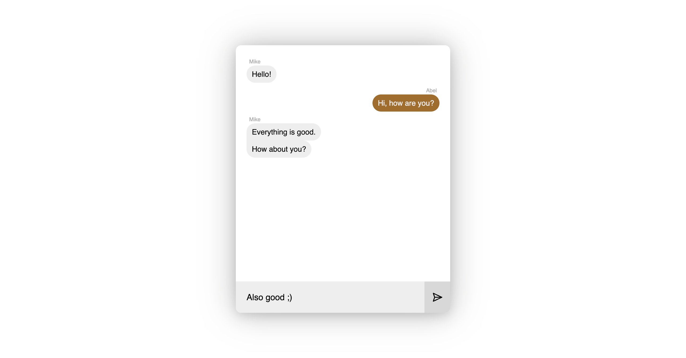

# Websocket Chat

This is a PoC / exploration project that I've built to gain some knowledge on websocket implementation on both client & server sides.

This project is set up as a monorepo split into `api`, `api-client` and `client-app` app, being a rest + socket api, a an abstracted api client and the front end application, respectively.

To run this project, simply clone the repo, run `cpm ci`, `npm start` and access `http://localhost:5050` in 2 different browsers to see things working.

> **Note:** This has only been tested with Node 18 & npm 9.